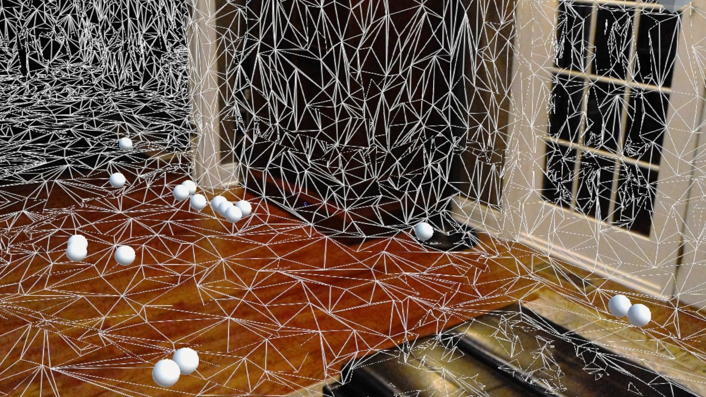

# HelloHolograms
A sample HoloLens technical demo initially based on the [Holograms 100 tutorial](https://developer.microsoft.com/en-us/windows/holographic/holograms_100) from the Holographic Academy. This one uses the HoloToolkit for Unity, and it also includes additional features like shooting balls around the space, and spatial mapping to use the real world in the virtual balls physics. The spatial mesh can be visually turned on and off, though it always remains active for collision detection.

**Unity version: 5.5.0f3 Release**

## Features
* Displays a cube 2 meters in front of the user.
* Use voice commands to switch between "Pickup mode" and "Shooting mode" (default at start).
* **Pickup Mode**: Air tap the cube to make the cube follow your gaze for placement. Tap again to place the cube.
* **Shooting Mode**: Shoot white balls into the environment by air tapping in the space; watch them bouce around the real-world space thanks to spatial mapping on the HoloLens.
* Spatial sound effects when shooting balls and when balls collide with the floor, environment and each other.
* Show or hide the spatial mesh of your environment with the "display mesh" and "hide mesh" voice commands.

## Implementation Notes
* This sample uses Unity's high performance physics by enabling Continuous Dynamic Collision Detection on the sphere prefab's Rigidbody to prevent issues where the sphere would fall through the floor's spatial mesh.
* I had a bug where the microphone capability was not set in package.appxmanifest in Visual Studio even though it was set in Unity, so I had to set it manually in the generated UWP project. I'm not sure if this is some bad setting in my project or a bug in the Unity Preview. You should nonetheless double-check this in your own generated UWP project before building & deploying.

## Acknowledgements
* **Shooting sound**: [Bow & Arrow Shot](http://opengameart.org/content/bow-arrow-shot) from [dorkster](http://opengameart.org/users/dorkster) on [OpenGameArt.org](http://opengameart.org/) 
* **Collision sound**: [Collision Nutfall](http://opengameart.org/content/collision-nutfall-yo-frankie) from [Blender Foundation](http://apricot.blender.org/) (submitted by [Lamoot](http://opengameart.org/users/lamoot)) on [OpenGameArt.org](http://opengameart.org/)

## Follow Me
* Twitter: [@ActiveNick](http://twitter.com/ActiveNick)
* Blog: [AgeofMobility.com](http://AgeofMobility.com)
* SlideShare: [http://www.slideshare.net/ActiveNick](http://www.slideshare.net/ActiveNick)
